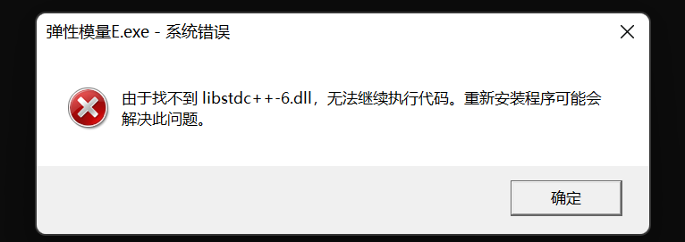
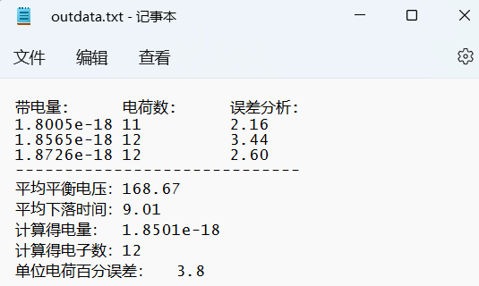

# 自用物理实验数据分析的小脚本 #
**我是<mark>夏离</mark>**
<!-- 我永远喜欢牛杂师傅！！！！！ -->
<!-- 干内，github网页md语法不支持h5标签 -->
#### <font color = blue>作者写在前面：</font> ####
<font size='5'>如果出现找不到libstdc++-6.dll无法继续执行代码的问题</font>  
  
请下载code中的libstdc++-6.dll复制到C:\Windows\System32  
* 瞎搞的
* 如有大佬路过，请手下留情  
* 登录GitHub并不是很流畅，所以。。。

事情的起因是大学物理实验开课了。好家伙第一个实验是密立根油滴实验。虽然要记录的实验数据并不多。这里采用的是<mark>  静态法测量油滴电量  </mark>，数据分析采用的是<mark>  反向验证法  </mark>。需要测量的是两个数据。一个是<mark>  平衡电压  </mark>。一个是<mark>  匀速下落时间  </mark>。然后计算式在我看来非常麻烦。然后就有小伙伴撺掇我用C++写个脚本出来处理这些数据。恰巧有点时间。就把它搞出来了。还有小伙伴让我做分享，就有了这些。。。
## 密立根油滴实验 ##
### 使用方法 ###
---
我这里实验要求是每个油滴测<mark>3</mark>次。一共测量<mark>5</mark>个油滴  
>ps:如果每个油滴的测量次数与3不同，请修改源代码中定义的常量  
`#define N 3`  
并将N后面的数值修改为你需要的数字并手动编译或者在自己的IDE环境中编译运行

1.直接使用`Millikan.exe`。
* 在同一个路径下放置数据文本文件`data.txt`  
格式如下：  
平衡电压<空格>下落时间  
以一个油滴的三组数据为例
```
170 9.10
168 8.99
168 8.94
```
* 正常应该有3 * 5 = 15 行数据。（ps：全怼一行里空格分开也不是不可以）  
然后一组数据出来的结果大概是这样：  
  
* 看，是不是很规整，很好看23333  
* 鉴于图片因为github访问原因，很可能加载不出来。贴个上图的文本样式
```
带电量:	电荷数:	误差分析:	
1.8005e-18	11		2.16
1.8565e-18	12		3.44
1.8726e-18	12		2.60
-----------------------------
平均平衡电压：	168.67
平均下落时间：	9.01
计算得电量：	1.8501e-18
计算得电子数：	12
单位电荷百分误差：	3.8
```

2.手动编译  
需要安装[mingw64](https://sourceforge.net/projects/mingw-w64/files/)并添加到系统环境变量~  
<mark>ps:关于mingw64下载，x86_64是64位？seh只64？sjlj兼容32？posix是linux平台。</mark>  
在cpp文件路径下右键"&emsp;在终端中打开&emsp;" 并输入以下代码  
`g++ Millikan.cpp -o 密立根油滴实验.exe`  
下面这个需要安装[mingw64](https://sourceforge.net/projects/mingw-w64/files/)和[LLVM](https://github.com/llvm/llvm-project)，并且都添加到系统环境变量  
在cpp文件路径下右键"&emsp;在终端中打开&emsp;" 并输入以下代码  
`clang++ --target=x86_64-pc-mingw64 Millikan.cpp -o 密立根油滴实验.exe`  

3.利用cpp源码复制到自己的IDE集成环境。  
比如VC6、Visual Studio community（社区版）、Clion之类的  
要能知道工作区路径，能把txt文本放到该放的路径里。  

## 光电效应研究 ##
应用`直线拟合.exe`(<-straight_line.cpp)，会根据`data.txt`给出的多个点的横纵坐标，利用最小二乘法公式，给出一个拟合到的直线方程。  
* 新增功能可以搜索桌面的`data.txt`了。原理是获得%homePath%的路径。不满足将无法实现，目前测试不能跨盘符。
* 数据示例（每行一对x y，以空格分开）：
```
1 3
2 6.2
3 9.8
```
* 最后得到的直线：
```
y = 3.4 * x + -0.466667
相关系数r：0.999424
```
>ps:相关系数r小于0.75不显示结果哦~
* 得到直线后。键入字符h求普朗克常量~  
键入其他字符退出程序~  
要求每行前一个数据，就是横坐标为光频率，单位10的14次方Hz，后一个数据为截止电压（正数），单位伏特  
结果如下：
```
实验测定的普朗克常数：6.79211e-34
误差：2.50579%
```
ps:比较神奇的事情是，这个直线拟合的cpp源码我在自己的VScode不能直接调试。终端会异常退出，但是编译没有问题。也能够运行。有知道原因的可以联系我~  
就下面这种情况：  
“C:\WINDOWS\System32\WindowsPowerShell\v1.0\powershell.exe”已终止，退出代码: 1。

>参考资料：  
[excel如何拟合直线](https://m.php.cn/topic/excel/470923.html)  
[普朗克常数的测定](https://wenku.baidu.com/view/8666c25401768e9951e79b89680203d8ce2f6ac3.html?_wkts_=1668475679597&bdQuery=%E6%99%AE%E6%9C%97%E5%85%8B%E5%B8%B8%E6%95%B0%E5%AE%9E%E9%AA%8C%E8%AE%A1%E7%AE%97)  
[最小二乘法公式](https://baike.baidu.com/item/%E6%9C%80%E5%B0%8F%E4%BA%8C%E4%B9%98%E6%B3%95%E5%85%AC%E5%BC%8F/6263689?fr=aladdin)  
[高中数学-线性回归中的相关系数.doc](https://max.book118.com/html/2018/1116/5111321143001331.shtm)
>>编者推荐：
[在线曲线拟合神器_村美小站](http://www.qinms.com/webapp/curvefit/cf.aspx)  

## 扭摆法测量刚体转动惯量实验 ##
应用`转动惯量.exe`(<-j.cpp)  
`data.txt`数据格式及单位如下，可放在桌面上
```
m1(g) m2(g) 柱(g) 柱(cm)
筒的质量(g) 筒外(cm) 筒内(cm) 
[五组扭摆半径(cm) 10T(s)] × 3
[圆盘 10T(s)]× 3
[圆盘+圆柱 10T(s)]× 3
[圆盘+圆筒 10T(s)]× 3
[圆盘+弹体 10T(s)]× 3
```

## 自由落体法测定重力加速度 ##
应用`g.exe`(<-g.cpp)  
`data.txt`数据格式及单位如下，可放在桌面上  
ps:g0不用输入。本校地区g0取9.792m/s²  
```
s0[OA](cm)
s2[AC](cm) {t2(s)} × 3
{ s1[AB](cm) {t1(s)} × 3 } × n（组数不限，正整数）
```

## 拉伸法测量金属丝的弹性模量 ##
应用`弹性模量E.exe`(<-E.cpp)  
按照提示进行窗口输入  
`data.txt`数据格式及单位如下，可放在桌面上  
```
光杠杆短臂长(cm) 长臂长(cm) 金属丝长度(cm)
金属丝上部直径(mm) 中部直径(mm) 下部直径(mm)
7.246 126.80 80.70
0.503 0.497 0.500
1.0 8.5 16.0 23.0 30.0 37.0
30.5 23.5 16.5 9.0 1.5 0.0
```
最后的输出示例：  
>PS：  
此输出示例Δ(Δn)被我从0.044手动修改成0.05，最终才与书上结果更近似。(源代码也有体现)  
其余误差均来自计算机二进制数据保存以及运算过程未近似导致的  
最终实际运行时Δ(Δn)也未近似。  
但最大相对误差和最大绝对误差严格按照向上进位的方式进行数据处理  
```
荷重砝码质量0kg时刻度n的平均值(mm):0
荷重砝码质量1kg时刻度n的平均值(mm):1.25
荷重砝码质量2kg时刻度n的平均值(mm):8.75
荷重砝码质量3kg时刻度n的平均值(mm):16.25
荷重砝码质量4kg时刻度n的平均值(mm):23.25
荷重砝码质量5kg时刻度n的平均值(mm):30.25
荷重砝码质量6kg时刻度n的平均值(mm):37

荷重砝码质量差3kg时的读数差:
n4 - n1 = 2.2	cm
n5 - n2 = 2.15	cm
n6 - n3 = 2.075	cm
Δn平均值 = 2.142

Δn的绝对误差:
Δ(Δn)1 = 0.058	cm
Δ(Δn)2 = 0.008	cm
Δ(Δn)3 = 0.067	cm
Δ(Δn) = 0.044	cm

弹性模量E(N·m²):	1.97465e+11
E的最大相对误差为:	3.11592%
向上近似为:	3.2%
E的最大绝对误差为:	6.31888e+09
E的测量结果为E = (1.97 +- 0.07) e+11N·m(-2)

```
>参考资料：  
[MATLAB、C++、OpenCV、Python、Python-Numpy近似值(取整)求取函数总结【round()、ceil()、floor()、fix()】](http://t.csdn.cn/ig5kA)  

## 铜棒线膨胀系数测量实验 ##
应用`Cu_α.exe`(<-Cu_α.cpp)  
需要按照提示进行窗口输入  
同时也需要`data.txt`数据文件，数据格式及单位如下，可放在桌面上  
（原理是计算同一温度下升温时刻度和降温时刻度的平均值与温度用最小二乘法进行直线拟合。升温和降温时刻度实验数据差距挺大的，大家的问题应该差不多）  
```
{铜棒温度(℃) 升温时刻度(mm) 降温时刻度()} × n(整数)
30 3.8 0.9
35 4.4 2.0
40 5.2 2.9
45 6.1 3.7
50 6.9 4.1
55 7.5 5.1
```

</br>
</br>
</br>

感谢<mark>@monny&emsp;</mark>提供的密立根油滴测电子电量实验示例数据  
感谢<mark>@Natural12349978&emsp;</mark>提供的普朗克常量测定实验示例数据  
感谢<mark>@Natural12349978&emsp;</mark>提供的刚体转动惯量测定实验示例数据  
感谢<mark>@monny&emsp;</mark>提供的重力加速度测定实验示例数据  
[^_^](如何联系我？可以在github留言。本文档尾也有其他方式)  
<!-- [帖子题主是我~](https://bbs.mihoyo.com/ys/article/17396735) -->
<!-- [网易云音乐~](https://music.163.com/#/user/home?id=587000409) -->


<!-- #include <iostream>
using namespace std;
#include <fstream>
#include <stdlib.h>
#include <cmath>

int main()
{	//输入输出文件打开##################
	system("chcp 65001");

    string path = "data.txt";
    ifstream fin (path);

	string string1 = getenv("homePath");
	string string2 = "/Desktop/";

    if (!fin)
    {
        path = (string1 + string2 + path).c_str();
        cout << "正在桌面路径\"" << path << "\"搜索数据文件" << endl;
        fin.clear();
        fin.open(path);
    }

	//这些特例将不进行测试。
	string path_out = "outdata.txt";
	path_out = (string1 + string2 + path_out).c_str();
	cout << "将结果导出到" << path_out << endl;
	ofstream fout (path_out);
	if (!fout)
	{
		cout << "输出到桌面失败，将输出到相对路径目录下" << endl;
		fout.clear();
		fout.open("outdata.txt");
		if (!fout)
			cout << "wrong" << endl;
	}
	//输入输出文件打开完毕############

	if (fin && fout)
	{

		fin.close();
		fout.close();
	}
	else
		cout << "wrong" << endl;

	system("pause");
	return 0;
} -->